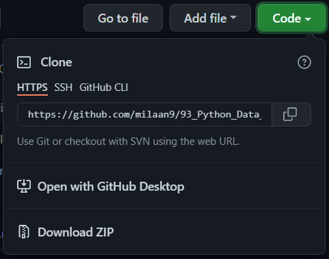

 
 
 
 

</a>
 

 
<!---->

 

 

    
 
# 93_Python_Data_Analytics_Projects

This repository contains all the data analytics projects that I've worked on python.

| **No.** | **Name** | 
| ------- | -------- | 
|	01	| **[001_Convert_IPython_to_PDF](https://github.com/milaan9/91_Python_Mini_Projects/tree/main/001_Convert_IPython_to_PDF)** | 
|	02	| **[002_Create_Digital_Clock_and_Stopwatch](https://github.com/milaan9/91_Python_Mini_Projects/tree/main/002_Create_Digital_Clock)** | 
|	03	| **[003_Convert_.py_to_.exe](https://github.com/milaan9/91_Python_Mini_Projects/tree/main/003_Convert_.py_to_.exe)** | 
|	04	| **[004_Find_IP_Address](https://github.com/milaan9/91_Python_Mini_Projects/tree/main/004_Find_IP_Address)** | 
|	05	| **[005_Test_Internet_Speed](https://github.com/milaan9/91_Python_Mini_Projects/tree/main/005_Test_Internet_Speed)** | 
|	06	| **[006_Check_Weather_Forecast](https://github.com/milaan9/91_Python_Mini_Projects/tree/main/006_Check_Weather_Forecast)** | 
|	07	| **[007_Create_AudioBook_from_PDF](https://github.com/milaan9/91_Python_Mini_Projects/tree/main/007_Create_AudioBook_from_PDF)** | 
|	08	| **[008_Generate_Random_Jokes](https://github.com/milaan9/91_Python_Mini_Projects/tree/main/008_Generate_Random_Jokes)** | 
|	09	| **[009_Convert_image_to_ASCII_Grayscale_Negative_and_Pencil_Sketch_Art](https://github.com/milaan9/91_Python_Mini_Projects/tree/main/009_Convert_image_to_ASCII)** | 
|	10	| **[010_Perform_Google_Search](https://github.com/milaan9/91_Python_Mini_Projects/tree/main/010_Perform_Google_Search)** | 
|	11	| **[011_Generate_QR_Code](https://github.com/milaan9/91_Python_Mini_Projects/tree/main/011_Generate_QR_Code)** | 
|	12	| **[012_Encode_CAPTCHA](https://github.com/milaan9/91_Python_Mini_Projects/tree/main/012_Encode_CAPTCHA)** | 
|	13	| **[013_Unzip_File](https://github.com/milaan9/91_Python_Mini_Projects/tree/main/013_Unzip_File)** | 
|	14	| **[014_Run_JavaScript_in_Python](https://github.com/milaan9/91_Python_Mini_Projects/tree/main/014_Run_JavaScript_in_Python)** | 
|	15	| **[015_Web_Scraping_Covid-19_Data](https://github.com/milaan9/91_Python_Mini_Projects/tree/main/015_Web_Scraping_Covid-19_Data)** | 
|	16	| **[016_Web_Scraping_CoWin_Vaccine_Slots](https://github.com/milaan9/91_Python_Mini_Projects/tree/main/016_Web_Scraping_CoWin_Vaccine_Slots)** | 
|	17	| **[017_Check_Weather_Forecast_with_GUI](https://github.com/milaan9/91_Python_Mini_Projects/tree/main/017_Check_Weather_Forecast_with_GUI)** | 
|	18	| **[018_Draw_Sakura_Tree](https://github.com/milaan9/91_Python_Mini_Projects/tree/main/018_Draw_Sakura_Tree)** | 
| 19 | **[019_Plagiarism_Checker](https://github.com/milaan9/91_Python_Mini_Projects/tree/main/019_Plagiarism_Checker)** |
| 20 | **[020_Road_Detection](https://github.com/milaan9/91_Python_Mini_Projects/tree/main/020_Road_Detection)** |

These are **read-only** versions. However you can **`Run ▶`**  all the codes **online** by clicking here ➞ 
020_Road_Detection
---

## Frequently asked questions ❔

### How can I thank you for writing and sharing this tutorial? 🌷

You can  and  Starring and Forking is free for you, but it tells me and other people that it was helpful and you like this tutorial.

Go [**`here`**](https://github.com/milaan9/91_Python_Mini_Projects) if you aren't here already and click ➞ **`✰ Star`** and **`ⵖ Fork`** button in the top right corner. You will be asked to create a GitHub account if you don't already have one.

---

### How can I read this tutorial without an Internet connection? 

1. Go [**`here`**](https://github.com/milaan9/91_Python_Mini_Projects) and click the big green ➞ **`Code`** button in the top right of the page, then click ➞ [**`Download ZIP`**](https://github.com/milaan9/91_Python_Mini_Projects/archive/refs/heads/main.zip).

    

2. Extract the ZIP and open it. Unfortunately I don't have any more specific instructions because how exactly this is done depends on which operating system you run.
    
3. Launch ipython notebook from the folder which contains the notebooks. Open each one of them
  
    **`Kernel > Restart & Clear Output`**
    
This will clear all the outputs and now you can understand each statement and learn interactively.

If you have git and you know how to use it, you can also clone the repository instead of downloading a zip and extracting it. An advantage with doing it this way is that you don't need to download the whole tutorial again to get the latest version of it, all you need to do is to pull with git and run ipython notebook again.

---

## Authors ✍️

I'm Dr. Milaan Parmar and I have written this tutorial. If you think you can add/correct/edit and enhance this tutorial you are most welcome🙏

See [github's contributors page](https://github.com/milaan9/91_Python_Mini_Projects/graphs/contributors) for details.

If you have trouble with this tutorial please tell me about it by [Create an issue on GitHub](https://github.com/milaan9/91_Python_Mini_Projects/issues/new) </h3> and I'll make this tutorial better. This is probably the best choice if you had trouble following the tutorial, and something in it should be explained better. You will be asked to create a GitHub account if you don't already have one.

If you like this tutorial, please [give it a ⭐ star](https://github.com/milaan9/91_Python_Mini_Projects).

---

## Licence 📜

You may use this tutorial freely at your own risk. See [LICENSE](./LICENSE).
